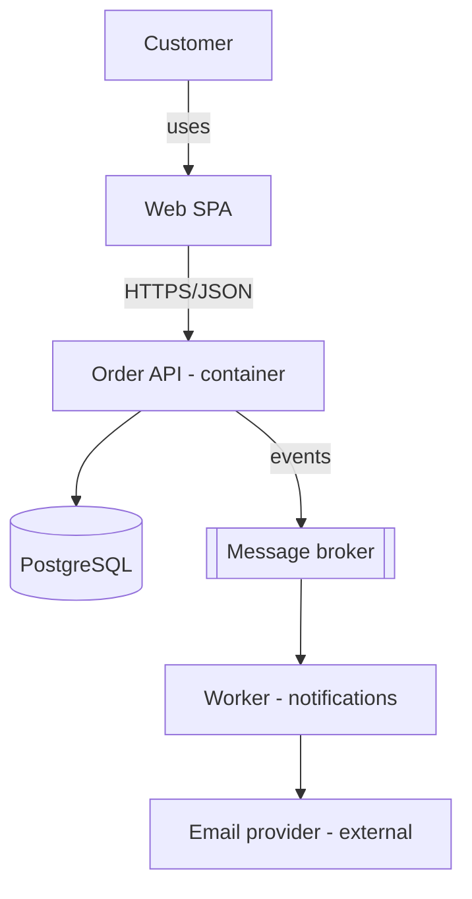

# Software Architecture Study

> [!abstract] Course Overview
> Comprehensive course on software architecture: from architectural thinking through every major style, to real-product design phases, cloud/VM deployment, and solution-architect-level trade-off analysis.
>
> **Primary source:** [Software Architecture full course (YouTube)](https://www.youtube.com/watch?v=YSQAXPRLZ4o) — all timestamped topics covered here, plus missing topics added (microkernel, service-based, space-based, serverless, modular monolith, saga, event sourcing, C4, ADRs, ATAM).
>
> **Structure:**
> - This note = reference + index
> - [[#Practice Drills|Practice]] = progressive design drills
> - [[#Workflows (Real-World Projects)|Workflows]] = full real-product projects on cloud & VMs

---

## 1. What is Software Architecture?

There is no single agreed definition. The most useful working one (Richards & Ford, *Fundamentals of Software Architecture*):

> Software architecture = **structure** + **architecture characteristics** + **architecture decisions** + **design principles**

| Dimension | Meaning | Example |
|---|---|---|
| **Structure** | The style(s) the system is built in | Microservices, layered, event-driven |
| **Characteristics** | The "-ilities" the system must support | Availability, scalability, security |
| **Decisions** | Hard rules — what is and isn't allowed | "Only the business layer talks to the DB" |
| **Design principles** | Guidelines, not rules | "Prefer async messaging between services" |

### Architecture vs Design

- **Architecture** = the stuff that's **hard to change later** (strategic): style, data ownership, communication model, technology boundaries.
- **Design** = the stuff you can refactor cheaply (tactical): class structure, patterns inside a component, naming.
- The boundary is a **spectrum**, not a wall. A good test: *"If this decision is wrong, how expensive is the fix?"* Expensive → architecture.

> [!tip] Everything in software architecture is a trade-off
> First Law of Software Architecture: *"Everything is a trade-off."* If you think you've found something that isn't, you haven't identified the trade-off yet. Second law: *"Why is more important than how."* — always record the reasoning (see [[#10.2 Architecture Decision Records (ADRs)|ADRs]]).

---

## 2. Architectural Thinking

Four aspects distinguish an architect's thinking from a developer's:

1. **Breadth over depth.** A developer has deep knowledge of a few stacks. An architect needs *broad* knowledge of many options — you can't choose between Kafka, RabbitMQ, and SQS if you only know one. Keep technical depth in a few areas, but invest in breadth.
2. **Trade-off analysis.** There are no "best" solutions, only least-worst ones for a *specific* context. Every choice you make gains something and loses something.
3. **Business drivers.** Translate business goals into architecture characteristics: "we need to onboard partners fast" → interoperability + extensibility; "Black Friday traffic" → elasticity.
4. **Balance hands-on coding.** Architects who stop coding lose credibility and the "feel" for consequences. Stay hands-on via prototypes, proof-of-concepts, code reviews, and fixing technical debt — not by owning critical-path features.

> [!warning] The Frozen Caveman anti-pattern
> Architects who over-weight a risk from a past trauma ("we got hacked once, so everything needs 5 layers of encryption"). Assess *actual* risk for *this* system.

---

## 3. Component-Based Thinking

A **component** is the architectural building block: a deployable/packagable unit of related code (a module, a JAR/package, a service).

**How to identify components:**

1. **Identify initial components** — guess a first partition based on the top-level workflow.
2. **Assign requirements/user stories** to components.
3. **Analyze roles & responsibilities** — does one component do too much? (God component)
4. **Analyze characteristics** — does one component need very different scalability/security than the rest? That's a hint to split.
5. **Iterate.** Component identification is never right the first time.

**Two partitioning strategies:**

| | Technical partitioning | Domain partitioning |
|---|---|---|
| Organize by | Layer/technical role (UI, business, persistence) | Business domain (Orders, Payments, Catalog) |
| Example style | Layered architecture | Modular monolith, microservices |
| Pros | Clear separation of technical concerns, familiar | Matches how business changes arrive; teams align to domains |
| Cons | A domain change touches every layer | Technical concerns duplicated across domains |

> [!tip] Conway's Law
> "Organizations design systems that mirror their communication structure." Domain partitioning works because business requests arrive per-domain. The *Inverse Conway Maneuver*: restructure teams to get the architecture you want.

---

## 4. Worked Example: Thinking Through a System

*(mirrors the video's example — an order/ticketing style system)*

**Scenario:** An online sandwich shop: customers order, pay, get delivery or pickup; the shop wants loyalty points and daily sales reports.

**Step 1 — extract architecture characteristics from requirements:**

| Requirement | Implied characteristic |
|---|---|
| "Customers order any time" | Availability |
| "Lunch rush 11:30–13:00" | Elasticity / scalability burst |
| "Payments" | Security, auditability |
| "Daily reports" | Not real-time → batch is fine |
| "Small company, 3 devs" | Simplicity, low operational cost |

**Step 2 — identify components:** OrderPlacement, MenuCatalog, Payment, LoyaltyPoints, KitchenDisplay, Reporting, Notification.

**Step 3 — pick structure:** 3 developers, moderate traffic, one business domain → a **modular monolith** (domain-partitioned) with an async queue only where spikes hurt (order intake), deployed on 2 small VMs behind a load balancer. Microservices would be over-engineering here.

**Step 4 — record the decision** as an ADR with the trade-offs (see [[#10.2 Architecture Decision Records (ADRs)|ADRs]]).

> [!example] The lesson
> The *thinking process* (characteristics → components → style → trade-offs → record) matters more than the answer. Redo this drill in [[01 - Architectural Thinking Drills]].

---

## 5. Quality Attributes — the "-ilities"

Architecture characteristics are the non-domain requirements the structure must support. There are 100+; you only design for the **top 3–7** — supporting all of them equally is impossible because many conflict.

### The core catalog

| Category | Attribute | Question it answers |
|---|---|---|
| **Operational** | Availability | What % of time is it up? (99.9% = 8.7h down/yr) |
| | Scalability | Can it handle growing load? |
| | Elasticity | Can it handle *sudden spikes* and scale back down? |
| | Performance | Latency & throughput under load |
| | Reliability / Fault tolerance | Does one failure take everything down? |
| | Recoverability | RTO/RPO — how fast and how much data loss on disaster? |
| | Observability | Can you tell what it's doing in production? (see [[Workflow 11 - OpenTelemetry - Logs Traces Metrics]]) |
| **Structural** | Maintainability | How easy to change? |
| | Extensibility | How easy to add features? |
| | Testability | How easy to verify? |
| | Deployability | How fast/safe is a release? |
| | Modularity / Reusability | Clean boundaries, shared parts |
| **Cross-cutting** | Security | AuthN/AuthZ, data protection |
| | Privacy / Compliance | GDPR, PCI-DSS, PDPA |
| | Interoperability | Plays well with other systems |
| | Usability, Accessibility | Human factors |
| | Cost | Always implicit, always a constraint |

### Key conflicts (memorize these)

- **Performance ↔ Security** (encryption, checks add latency)
- **Scalability ↔ Consistency** (CAP theorem — distributed systems pick availability or consistency under partition)
- **Deployability/Agility ↔ Reliability** (ship faster = more change risk; mitigated by testability)
- **Everything ↔ Cost & Simplicity**

> [!tip] Make characteristics measurable
> "Fast" is not a requirement. "p99 checkout latency < 800ms at 500 RPS" is. Measurable characteristics can become **fitness functions** — automated tests of the architecture (e.g., a CI check that fails if the persistence layer is imported by the UI layer).

Practice: [[02 - Quality Attributes Drills]]

---

## 6. Monolithic vs Distributed

The single most consequential fork in the road.

| | Monolithic (single deployment unit) | Distributed (many deployment units) |
|---|---|---|
| Simplicity | ✅ one build, one deploy, one debug | ❌ network, versioning, partial failure |
| Cost | ✅ cheap to build & run | ❌ expensive (infra + people) |
| Performance (in-process) | ✅ function calls, one DB, ACID | ❌ network hops, serialization |
| Scalability | ❌ scale everything together | ✅ scale hot parts independently |
| Fault tolerance | ❌ one crash = all down (mitigate: run 2+) | ✅ isolate failures (if designed for it) |
| Deployability | ❌ everything ships together | ✅ small, frequent, independent deploys |
| Team autonomy | ❌ coordination overhead grows | ✅ team-per-service |
| Data consistency | ✅ ACID transactions | ❌ eventual consistency, sagas |

> [!warning] The 8 Fallacies of Distributed Computing
> Assumptions that will burn you: 1) the network is reliable, 2) latency is zero, 3) bandwidth is infinite, 4) the network is secure, 5) topology doesn't change, 6) there is one administrator, 7) transport cost is zero, 8) the network is homogeneous.

> [!tip] Default answer
> **Start with a well-modularized monolith.** Extract services only when a *specific* driver demands it (independent scaling, team scaling, fault isolation, differing tech needs). "Microservices-first" is the most common over-engineering mistake — you pay distributed-systems tax with none of the organizational benefit.

### Single App vs Multiple App architecture types

- **Single application** styles shape the *inside* of one deployable: [[#7.1 Layered Architecture|Layered]], [[#7.2 Clean Architecture|Clean]], [[#7.3 Hexagonal Architecture (Ports & Adapters)|Hexagonal]], [[#7.4 Pipeline Architecture|Pipeline]], [[#7.5 Microkernel (Plugin) Architecture|Microkernel]].
- **Multiple application** styles shape the *system of deployables*: [[#8.1 Client/Server|Client/Server]], [[#8.2 3-Tier & N-Tier|N-Tier]], [[#8.4 Microservices|Microservices]], [[#8.5 Event-Driven Architecture (EDA)|Event-Driven]], [[#8.6 Space-Based Architecture|Space-Based]], [[#8.7 Serverless|Serverless]].
- They **compose**: each microservice can be hexagonal inside.

---

## 7. Single-Application (Monolithic) Styles

### 7.1 Layered Architecture

The classic n-layer, **technically partitioned** style.

```
┌─────────────────────────┐
│   Presentation Layer    │  controllers, views, API endpoints
├─────────────────────────┤
│    Business Layer       │  domain rules, services
├─────────────────────────┤
│   Persistence Layer     │  repositories, ORM
├─────────────────────────┤
│    Database Layer       │  the DB itself
└─────────────────────────┘
        (closed layers: requests pass top → down only)
```

- **Closed layers**: a request must pass through each layer (isolation — swap the persistence layer without touching presentation). **Open layers** allowed for shared utilities.
- ✅ Simple, cheap, universally understood, good separation of technical concerns. Great first architecture and for small/simple systems.
- ❌ Domain changes smear across all layers; tends toward the **"architecture sinkhole"** anti-pattern (requests pass through layers doing nothing); scales/deploys as one lump; low fault tolerance.
- **Rating:** simplicity ★★★★★, cost ★★★★★, scalability ★, deployability ★.

### 7.2 Clean Architecture

(Uncle Bob; siblings: Onion Architecture.) Concentric circles; **all dependencies point inward** toward the domain.

```
┌───────────────────────────────────┐
│ Frameworks & Drivers (DB, Web, UI)│
│  ┌─────────────────────────────┐  │
│  │ Interface Adapters          │  │
│  │  (controllers, gateways,    │  │
│  │   presenters, repos impl)   │  │
│  │  ┌───────────────────────┐  │  │
│  │  │ Use Cases (app logic) │  │  │
│  │  │  ┌─────────────────┐  │  │  │
│  │  │  │ Entities (core  │  │  │  │
│  │  │  │ business rules) │  │  │  │
│  │  │  └─────────────────┘  │  │  │
│  │  └───────────────────────┘  │  │
│  └─────────────────────────────┘  │
└───────────────────────────────────┘
     Dependency Rule: point INWARD only
```

- The **Dependency Rule**: inner circles know nothing about outer circles. The DB and the web framework are *details*, injected via interfaces (Dependency Inversion).
- ✅ Business logic is framework-independent and supremely testable (unit-test the core with zero infrastructure); easy to swap DB/UI/framework.
- ❌ Indirection & boilerplate (interfaces, mappers, DTOs per boundary); overkill for CRUD apps; requires discipline.
- Compared to layered: layered organizes by *technical role top-down*; clean organizes by *distance from the domain*, inverting the DB dependency.

### 7.3 Hexagonal Architecture (Ports & Adapters)

(Alistair Cockburn.) Same core idea as Clean with different vocabulary — many consider Clean/Onion refinements of it.

```
            ┌──────────── Adapters (driving) ───────────┐
 HTTP ──►  REST Adapter ─┐                              │
 CLI  ──►  CLI Adapter  ─┤►(Port: OrderUseCase)         │
 Tests ──► Test Adapter ─┘   ┌──────────────┐           │
                             │  Application │           │
                             │     Core     │           │
                             │ (domain +    │           │
                             │  use cases)  │           │
                             └──────┬───────┘           │
              (Port: OrderRepository)│(Port: PaymentGateway)
 Postgres ◄─ SQL Adapter ◄──────────┘└─────► Stripe Adapter
            └──────────── Adapters (driven) ────────────┘
```

- **Ports** = interfaces the core defines. **Driving adapters** call the core (REST, CLI, message consumer); **driven adapters** are called by the core (DB, payment API, mail).
- ✅ Same testability/swappability wins as Clean; vocabulary maps beautifully to messaging systems (a Kafka consumer is just another driving adapter).
- ❌ Same costs: indirection, mapping, ceremony.

> [!info] Layered vs Clean vs Hexagonal — how to choose
> All three are monolith-internal organizations. Layered = simplest, DB-centric, fine for CRUD. Clean/Hexagonal = domain-centric, worth it when business logic is complex and long-lived. If your "business logic" is 90% database reads/writes, Clean's ceremony buys you little.

### 7.4 Pipeline (Pipes & Filters) Architecture

```
source ──pipe──► [filter: parse] ──pipe──► [filter: validate] ──pipe──► [filter: transform] ──pipe──► sink
```

- **Filters** are self-contained, single-purpose processing steps; **pipes** are one-way channels between them. Filter types: producer (source), transformer, tester (filter/route), consumer (sink).
- Real examples: Unix shell (`cat log | grep ERROR | sort | uniq -c`), ETL jobs, compilers, stream-processing topologies, CI pipelines.
- ✅ Simple, composable, filters reusable & independently testable. ❌ One deployment unit usually; not for interactive request/response; poor fit when steps need shared state.

### 7.5 Microkernel (Plugin) Architecture

*(not in the video — added)*

```
┌────────────────────────────────┐
│          Core System           │  minimal happy path
│  (plugin registry + contracts) │
└──┬─────────┬─────────┬─────────┘
   │         │         │
 [Plugin A][Plugin B][Plugin C]   isolated, swappable features
```

- A minimal **core** plus independent **plug-ins** registered through contracts. Examples: IDEs (VS Code, Eclipse), browsers, payment gateways with per-country rules, claims-processing systems.
- ✅ Extensibility, isolation of volatile/custom logic, ship plugins independently of core. ❌ Core contract design is hard; core is still a single point of change.
- Choose when: product has a stable core + highly variable per-customer/per-region behavior.

---

## 8. Distributed (Multiple-Application) Styles

### 8.0 Synchronous & Asynchronous Communication

The communication model matters more than the style label.

| | Synchronous | Asynchronous |
|---|---|---|
| Mechanics | Caller **waits** for response (HTTP/REST, gRPC) | Caller sends and **continues** (queues, topics, events) |
| Coupling | Temporal coupling: both sides must be up *now* | Decoupled in time: broker buffers |
| Failure | Errors propagate immediately (easy to reason) | Must handle: retries, DLQs, duplicates, ordering |
| Latency behavior | Latency chains add up; cascading failures | Absorbs spikes (back-pressure via queue) |
| Semantics | Request/response, easy consistency | Eventual consistency, at-least-once delivery |
| Debugging | Simple traces | Needs correlation IDs + distributed tracing |

Patterns to know: **request/response**, **fire-and-forget**, **publish/subscribe**, **request/reply over messaging** (correlation ID + reply queue).

> [!warning] At-least-once means duplicates
> Any serious message broker redelivers. Consumers must be **idempotent** (dedupe by message ID or make the operation naturally idempotent). Exactly-once is (mostly) a lie at the application level.

### 8.1 Client/Server

The grandparent style: a **client** (desktop app, browser, mobile) talks to a **server** (DB or app server). 2-tier "fat client" apps (client has logic + UI, server = database) dominated the 90s and still exist (many internal tools). Modern web/mobile apps are still client/server — just with more tiers behind the server.

### 8.2 3-Tier & N-Tier

```
[ Presentation tier ]  browser/SPA/mobile
         │ HTTPS
[ Application tier  ]  API / business logic (stateless → scale horizontally)
         │
[   Data tier       ]  database, cache
```

- **Tier = physically separate deployment**, vs **layer = logical separation inside one deployable**. A layered monolith deployed as one unit is 1-tier, n-layer.
- ✅ Stateless middle tier scales horizontally behind a load balancer; tiers secured/scaled separately; the workhorse of most web apps and the natural shape of a cloud VM deployment.
- ❌ Still one application at the middle tier — deploys as a lump; the DB is often the bottleneck & single point of failure.

### 8.3 Service-Based Architecture

*(not in the video — added; the pragmatic middle ground)*

- A handful (4–12) of **coarse-grained domain services** (e.g., OrderService, CatalogService), usually sharing **one database**, often behind one UI/gateway.
- ✅ Most of microservices' team/deploy benefits with a fraction of the cost — no distributed transactions (shared DB keeps ACID), no service-per-table explosion. **The most sensible first distributed architecture** for most teams.
- ❌ Shared DB = coupling point (schema changes need coordination); services are coarser, so less independent scaling.

### 8.4 Microservices Architecture

```
                    ┌─────────────┐
   clients ───────► │ API Gateway │
                    └──┬───┬───┬──┘
             ┌─────────┘   │   └─────────┐
        ┌────▼────┐   ┌────▼────┐   ┌────▼────┐
        │ Orders  │   │ Payment │   │ Catalog │   each: own codebase,
        │ Service │   │ Service │   │ Service │   own deploy pipeline,
        └────┬────┘   └────┬────┘   └────┬────┘   own team
        ┌────▼────┐   ┌────▼────┐   ┌────▼────┐
        │ OrdersDB│   │ PayDB   │   │ CatDB   │   own database!
        └─────────┘   └─────────┘   └─────────┘
```

Defining traits: services model **bounded contexts** (from Domain-Driven Design); each owns its **data** (no shared DB); independently deployable; communicate via light protocols (REST/gRPC/events); decentralized governance.

Supporting cast you *must* budget for: API gateway, service discovery, distributed tracing, centralized logging, CI/CD per service, container orchestration (Kubernetes), secrets management, contract testing.

- ✅ Independent deploy & scale per service; fault isolation; team autonomy at scale; per-service tech choice; small blast radius per change.
- ❌ Highest cost & complexity of any style; network tax on every workflow; **no ACID across services** → sagas & eventual consistency; hard to get service boundaries right (wrong boundaries = "distributed monolith", the worst of both worlds); operationally demanding.
- **Granularity heuristics:** split for cohesion, volatility, scale, fault isolation, security differences. Merge when services chat constantly, share transactions, or share data heavily.

> [!warning] Distributed monolith
> If you must deploy 6 services together for one feature, you have a monolith paying microservices rent. Boundary quality > service count.

### 8.5 Event-Driven Architecture (EDA)

Components communicate by producing/consuming **events** ("OrderPlaced") — facts about things that happened, not commands.

**Two topologies:**

```
BROKER topology (choreography-flavored):
  OrderPlaced ──► [Payment svc] ──PaymentCaptured──► [Fulfillment] ──Shipped──► [Notification]
  events chain from service to service via topics; no central brain

MEDIATOR topology (orchestration-flavored):
  request ──► [Mediator/Orchestrator] ──cmd──► Payment
                        │◄─────reply────────────┘
                        ├──cmd──► Fulfillment ...
  central coordinator sends commands, tracks workflow state
```

- **Events vs commands/messages:** an event announces the past ("OrderPlaced", broadcast, producer doesn't know consumers); a command requests work ("CapturePayment", one addressee, sender cares about outcome).
- ✅ Extreme decoupling (add a consumer without touching producers), elastic scale, spike absorption, natural audit trail.
- ❌ Hard to see/test end-to-end flow; eventual consistency; duplicate/out-of-order delivery; error handling is *hard* (where does a failed event chain surface?).
- Tech: Kafka (log, replayable, partitions), RabbitMQ (smart broker, routing), AWS SNS/SQS/EventBridge, NATS.

### 8.6 Space-Based Architecture

*(not in the video — added)* Removes the database from the synchronous request path: **processing units** keep data in **replicated in-memory grids**; writes trickle to the DB asynchronously. Built for extreme, spiky concurrency (ticket sales, flash sales, high-frequency bidding). ✅ Near-linear elasticity, DB no longer the bottleneck. ❌ Very complex (replication, cache collisions on high contention), expensive, data only eventually durable.

### 8.7 Serverless / FaaS

*(not in the video — added)* Functions (Lambda/Cloud Functions) triggered by events; managed services (API Gateway, DynamoDB, S3, EventBridge) for everything else. You own zero servers. ✅ No ops, scale-to-zero cost, per-request billing, pairs perfectly with EDA. ❌ Cold starts, execution limits, vendor lock-in, local dev/test friction, cost explodes at sustained high throughput (crossover point vs containers).

### 8.8 Modular Monolith

*(not in the video — added; the modern default recommendation)* One deployable, **domain-partitioned** into modules with enforced boundaries (module = own package, own tables, public API only; enforced by build tooling/fitness functions). ✅ Monolith simplicity + microservice-ready seams: any module can be extracted later because boundaries are already clean. This is the recommended starting point for new products.

---

## 9. Coordination & Data Patterns

### 9.1 Orchestration vs Choreography

How multi-service workflows are coordinated:

| | Orchestration | Choreography |
|---|---|---|
| Control | Central **orchestrator** commands each step | Each service reacts to events, no central brain |
| Workflow visibility | ✅ in one place; easy to see/monitor state | ❌ emergent; spread across services |
| Error handling | ✅ centralized (retries, compensations in one spot) | ❌ distributed & hard |
| Coupling | Services coupled to orchestrator | Services coupled to event contracts only |
| Single point of failure/bottleneck | The orchestrator | None |
| Adding a step | Change the orchestrator | Just subscribe a new service (if step is additive) |
| Fits | Complex workflows: many steps, branches, compensations (e.g., loan approval) | Simple/linear or broadcast-y flows (e.g., "notify everyone interested") |
| Tools | Temporal, Camunda, AWS Step Functions | Kafka/RabbitMQ topics + conventions |

> [!tip] Rule of thumb
> The more steps, branching, and error-compensation a workflow has, the more orchestration wins. Mix freely per-workflow: orchestrate checkout, choreograph notifications.

### 9.2 Saga Pattern

*(not in the video — added; full deep-dive: [[Workflow 10 - Saga Patterns Deep Dive]])* Distributed transactions without 2PC: a saga = sequence of local transactions, each publishing an event/triggering the next; failures trigger **compensating transactions** to undo prior steps (semantic rollback: `CancelReservation`, `RefundPayment`). Orchestrated sagas (state machine drives it) vs choreographed sagas (event chain). Gotchas: compensations can fail too; design for **idempotency + retries**; some actions aren't compensatable (sent email) — order steps so risky ones go last.

### 9.3 CQRS — Command Query Responsibility Segregation

Split the **write model** (commands: validate & mutate) from the **read model** (queries: shaped for display):

```
           Commands (CreateOrder, ChangeAddress)
 client ──────────────► [ Write model ] ──► Write DB (normalized)
                              │ events / CDC
                              ▼ (projection – eventually consistent)
 client ◄────────────── [ Read model  ] ◄── Read DB (denormalized views,
           Queries (GetOrderHistory)         maybe Elasticsearch/replicas)
```

- Why: read and write workloads differ wildly (shape, volume, scaling). Reads often outnumber writes 100:1; complex domains want normalized writes but denormalized reads.
- Levels of CQRS (use the lightest that works): (1) separate query/command classes on one DB → (2) read replicas for queries → (3) separate, differently-shaped read store fed by events.
- ✅ Independent scaling & optimal models per side; pairs naturally with EDA and event sourcing. ❌ Eventual consistency between write & read (UI must tolerate stale reads), duplication, more moving parts. **Don't CQRS a simple CRUD app.**

### 9.4 Event Sourcing

*(not in the video — added; frequent CQRS companion)* Store the **sequence of events** (`OrderPlaced`, `ItemAdded`, `OrderShipped`) as the source of truth instead of current state; rebuild state by replay; snapshot for speed. ✅ Perfect audit log, temporal queries ("state as of March"), replay to build new read models. ❌ Event schema versioning is forever, querying requires projections, deep team learning curve. Use for domains that *are* ledgers (payments, accounting, inventory); avoid elsewhere.

---

## 10. The Design Phase in a Real Product

*(added — how architecture actually happens at work)* Full worked project: [[Workflow 1 - Design Phase of a Real Product]].

### 10.1 The process

```
Business goals ─► Requirements & constraints ─► Architecture characteristics (top 3-7)
      ─► Domain decomposition (components/bounded contexts)
      ─► Candidate styles ─► Trade-off analysis ─► Decision + ADRs
      ─► C4 diagrams ─► Walking skeleton / PoC ─► Iterate (architecture is never "done")
```

1. **Gather drivers:** functional requirements, constraints (budget, team, deadline, compliance), and quality attribute requirements — make each measurable (see [[#5. Quality Attributes — the "-ilities"|-ilities]]).
2. **Decompose the domain** (DDD-lite): find bounded contexts through event storming or noun/verb analysis of user journeys.
3. **Generate 2–3 candidate architectures.** One candidate is not a decision, it's a default.
4. **Score candidates against the top characteristics** (trade-off matrix — see [[#12. Solution-Architect Trade-off Analysis|§12]]).
5. **Decide & record** in ADRs; **diagram** in C4; **prove** the risky bits with a walking skeleton (thin end-to-end slice through all layers/services deployed to real infra).

### 10.2 Architecture Decision Records (ADRs)

Short markdown docs, numbered, immutable once accepted:

```markdown
# ADR-007: Use PostgreSQL for the order store
Status: Accepted (2026-07-11)      Supersedes: ADR-003
## Context
Orders need ACID; team knows SQL; expected 200 writes/s peak...
## Decision
PostgreSQL 16 on RDS, single-writer + 1 read replica.
## Consequences
+ ACID, team familiarity, mature tooling
- Vertical write scaling ceiling ~X; revisit if writes 10x
## Alternatives considered
DynamoDB (rejected: access patterns unstable), MySQL (no strong driver)
```

> [!tip] "Why is more important than how"
> Six months later nobody remembers *why*. ADRs are the cheapest, highest-value architecture artifact that exists.

### 10.3 C4 Diagrams

Four zoom levels; you mostly need the first two:

1. **Context** — the system as one box + users + external systems.
2. **Container** — the deployable units (SPA, API, DB, queue) and how they talk. *(container ≠ Docker; it means "runtime unit")*
3. **Component** — inside one container.
4. **Code** — class diagrams (rarely worth maintaining).



---

## 11. Deploying Architectures on Cloud & VMs

*(added)* Full worked projects: [[Workflow 2 - Modular Monolith on a Cloud VM]], [[Workflow 3 - Microservices and Event-Driven on Cloud]].

### 11.1 The compute spectrum

| | VM (EC2/Compute Engine) | Containers (K8s/ECS/Cloud Run) | Serverless (Lambda/CF) |
|---|---|---|---|
| You manage | OS up | container up | code only |
| Startup | minutes | seconds | ms–s (cold start) |
| Scaling granularity | whole VM | pod/container | per request |
| Cost model | per hour, always-on | per node/vCPU | per invocation |
| Best for | steady load, legacy, DBs, full control | most services, portability | spiky/event-driven, glue, low-traffic APIs |

### 11.2 Style → typical cloud mapping (AWS terms; GCP/Azure equivalents in parens)

| Architecture | Typical deployment |
|---|---|
| Layered / modular monolith | 2+ VMs or containers behind an **ALB** (Cloud LB), **RDS** (Cloud SQL) multi-AZ, **ElastiCache**, S3+CDN for static |
| 3-tier | Same, tiers in separate subnets: public LB / private app / private DB |
| Service-based | A few ECS/Cloud Run services + one RDS |
| Microservices | **EKS/GKE (Kubernetes)** or ECS, API Gateway, service mesh at scale, DB-per-service |
| Event-driven | **SQS/SNS/EventBridge** (Pub/Sub) or **MSK/Kafka**; consumers as containers or Lambdas |
| CQRS | Writes → RDS; projections via streams (DynamoDB Streams/Debezium/Kafka) → read store (replica/Elasticsearch/DynamoDB) |
| Serverless | API Gateway + Lambda + DynamoDB + EventBridge + Step Functions (orchestration) |

### 11.3 Cloud building blocks that shape architecture

- **Regions & AZs** — multi-AZ = table stakes for availability (LB across AZs, DB standby in another AZ). Multi-region = 10x complexity; only for real DR/latency needs.
- **Stateless app tier** — sessions to Redis/JWT so any instance can serve any request → horizontal scaling & rolling deploys work.
- **Managed > self-hosted** for undifferentiated heavy lifting (DBs, brokers, LBs) — trade $ for ops time, accept some lock-in.
- **Autoscaling** solves elasticity but only if startup is fast and the app is stateless; the DB rarely autoscales with you.
- **Everything fails**: design for instance death (health checks, auto-replace), AZ loss (multi-AZ), and dependency loss (timeouts, retries with backoff + jitter, circuit breakers).

---

## 12. Solution-Architect Trade-off Analysis

*(added — the capstone skill; full case study: [[Workflow 5 - Solution Architecture Case Study with Trade-offs]])*

### 12.1 The method (lightweight ATAM)

1. **List the top architecture characteristics** with measurable targets, weighted by business priority.
2. **Generate 2–3 real candidates** (if you can't name a viable alternative, you don't understand the problem yet).
3. **Build a weighted trade-off matrix:**

| Criterion (weight) | Modular monolith on VMs | Service-based on ECS | Full microservices on EKS |
|---|---|---|---|
| Time-to-market (×3) | 5 → 15 | 4 → 12 | 2 → 6 |
| Scalability (×2) | 3 → 6 | 4 → 8 | 5 → 10 |
| Team fit, 6 devs (×3) | 5 → 15 | 4 → 12 | 2 → 6 |
| Fault tolerance (×2) | 3 → 6 | 4 → 8 | 5 → 10 |
| Run cost (×2) | 5 → 10 | 4 → 8 | 2 → 4 |
| **Total** | **52** | **48** | **36** |

4. **Interrogate the sensitive cells:** which scores would flip the decision? ("If traffic 10x, scalability weight rises — does the winner change?") Those are your **risks**; attach mitigation/exit plans (e.g., modular boundaries → extraction path).
5. **Record the decision + losing options in an ADR.** The matrix is judgment made visible, not arithmetic truth — its value is forcing explicit reasoning.

### 12.2 Trade-off cheat sheet

| If you choose… | You gain | You pay |
|---|---|---|
| Monolith | simplicity, speed, ACID, cheap | scaling/deploy coupling, blast radius |
| Microservices | independent scale/deploy/teams | ops cost, eventual consistency, network tax |
| Sync (REST/gRPC) | simplicity, immediate consistency | temporal coupling, cascading failure |
| Async (events) | decoupling, spike absorption | complexity, duplicates, eventual consistency |
| Orchestration | visibility, central error handling | coupling to orchestrator, bottleneck |
| Choreography | loose coupling, easy to extend | invisible workflows, distributed errors |
| CQRS | per-side optimization & scale | stale reads, duplication |
| Event sourcing | audit, replay, temporal queries | schema-forever, projection complexity |
| Serverless | no ops, scale-to-zero | cold starts, lock-in, cost at scale |
| Managed cloud services | ops time back | $ + lock-in |
| Shared DB | ACID, simple queries | schema coupling between services |
| DB-per-service | autonomy, isolation | joins die, sagas required |

> [!tip] The solution architect's real job
> Not picking technologies — **making trade-offs explicit, tying them to business drivers, and writing them down** so the org makes the least-worst choice on purpose.

---

## 13. Anti-Patterns Quick Reference

| Anti-pattern | Smell |
|---|---|
| Ivory Tower Architect | Decrees without coding; devs route around them |
| Big Ball of Mud | No discernible structure at all |
| Distributed Monolith | Services that must deploy together |
| Golden Hammer | One familiar tech for every problem |
| Resume-Driven Development | Tech chosen for coolness, not fit |
| Architecture Sinkhole | Layers that only pass data through |
| Premature microservices | Distributed tax before the org needs it |
| Analysis Paralysis | Designing forever, shipping never |

---

## Practice Drills

Progressive drills — do them in order, write answers by hand before opening solutions:

1. [[01 - Architectural Thinking Drills]] — definitions, thinking, components
2. [[02 - Quality Attributes Drills]] — extracting & measuring -ilities
3. [[03 - Monolith Styles Drills]] — layered, clean, hexagonal, pipeline, microkernel
4. [[04 - Distributed Styles Drills]] — n-tier, microservices, EDA, serverless
5. [[05 - Communication and Data Drills]] — sync/async, orchestration, saga, CQRS
6. [[06 - Trade-off Analysis Drills]] — solution-architect decision drills

## Workflows (Real-World Projects)

1. [[Workflow 1 - Design Phase of a Real Product]] — requirements → characteristics → C4 → ADRs for a food-delivery product
2. [[Workflow 2 - Modular Monolith on a Cloud VM]] — design & deploy a monolith on VMs (3-tier, multi-AZ)
3. [[Workflow 3 - Microservices and Event-Driven on Cloud]] — decompose, build, and run on Kubernetes + broker
4. [[Workflow 4 - CQRS and Event Sourcing Service]] — build a CQRS/ES order service
5. [[Workflow 5 - Solution Architecture Case Study with Trade-offs]] — full SA engagement with weighted trade-off analysis

**Famous system-design cases** (interview classics, each built on the patterns above):

6. [[Workflow 6 - Design a News Feed (Twitter-style)]] — fan-out on write vs read, the celebrity problem, CQRS at planetary scale
7. [[Workflow 7 - Design a Chat System (WhatsApp-style)]] — stateful connections, delivery guarantees, ordering, presence
8. [[Workflow 8 - Design Video Streaming (YouTube-style)]] — transcoding pipelines, CDN-first serving, adaptive bitrate
9. [[Workflow 9 - Design Ride-Hailing (Uber-style)]] — geospatial indexing, matching under contention, trip state machines

**Pattern deep-dives:**

10. [[Workflow 10 - Saga Patterns Deep Dive]] — 2PC vs saga, choreography vs orchestration built side by side, compensation zones, idempotency plumbing
11. [[Workflow 11 - OpenTelemetry - Logs Traces Metrics]] — the three signals clarified, context propagation, the Collector, two production mysteries solved metric→trace→log

## Suggested Study Plan

| Week | Focus |
|---|---|
| 1 | §1–4 + drills 01 |
| 2 | §5–6 + drills 02 |
| 3 | §7 + drills 03 |
| 4 | §8 + drills 04 |
| 5 | §9 + drills 05 |
| 6 | §10 + Workflow 1 |
| 7 | §11 + Workflows 2–3 |
| 8 | §12 + drills 06 + Workflows 4–5 |
| 9–10 | Famous cases: Workflows 6–9 (one per half-week, timed, from memory first) |
| 11 | Pattern deep-dives: Workflows 10–11 (saga, observability) |

## Further Reading

- *Fundamentals of Software Architecture* — Richards & Ford (the video closely follows this)
- *Software Architecture: The Hard Parts* — Ford, Richards, Sadalage, Dehghani
- *Designing Data-Intensive Applications* — Kleppmann
- *Clean Architecture* — Robert C. Martin
- *Building Microservices* — Sam Newman
- c4model.com, adr.github.io
